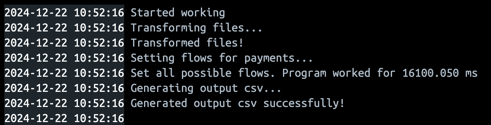
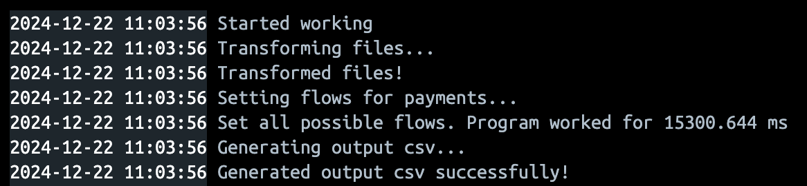

# Xmas hack. Кейс №1 - CardON

## Запуск в Docker

### Prerequisites

- Установленный Docker Desktop ([гайд](https://docs.docker.com/desktop/))

- Терминал

### Запуск

- Склонируйте репозиторий на локальное устройство

- Либо при помощи терминала дойдите до папки, куда клонировали репозиторий, либо откройте папку в любимом редакторе кода

- Откройте Docker Desktop (чтобы Docker Daemon запустился)

- Убедитесь, что вы в корне проекта в терминале

- В папку src/files/csv положите необходимые csv файлы. Если названия отличаются от "ex_rates", "payments_1", "payments_2", "providers_1", "providers_2", то поменяйте их в main.py ТОЛЬКО в создании объекта типа ETLProcessor

- Пропишите в терминал: ``` docker-compose up --build -d ```

- Зайдите в файлы в Докере, в папку src/files/result, и при помощи кнопки save скачайте файл с flow транзакций (дождитесь пока появится файл)

- После того, как скачали файл, подождите 30 секунд

- Посмотрите либо в консоль Docker Desktop (logs), либо пропишите в терминал ``` docker-compose logs ```, чтобы посмотреть подсчитанные метрики и логи

- После того, как закончили работу с контейнером, пропишите в терминал ``` docker-compose down -v ```

## Performance тесты

### Проводились на Macbook Air M3 8/256

Файл payments_1 + providers_1 + ex_rates:



Файл payments_2 + providers_2 + ex_rates:


